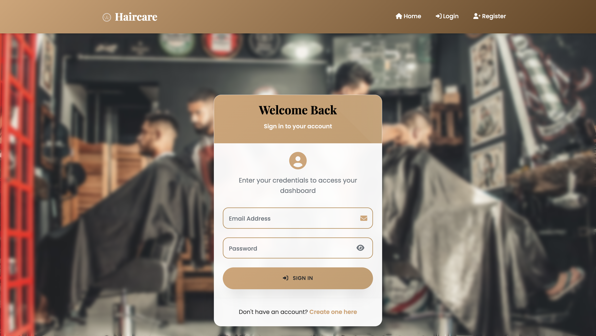
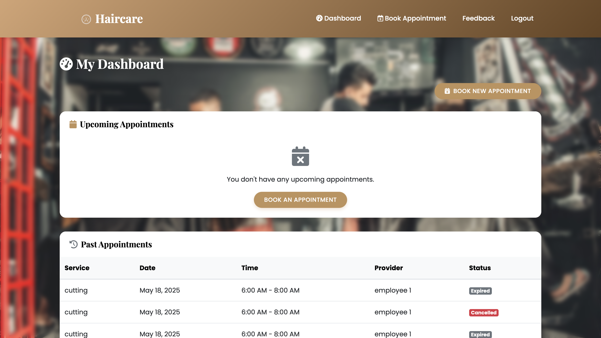
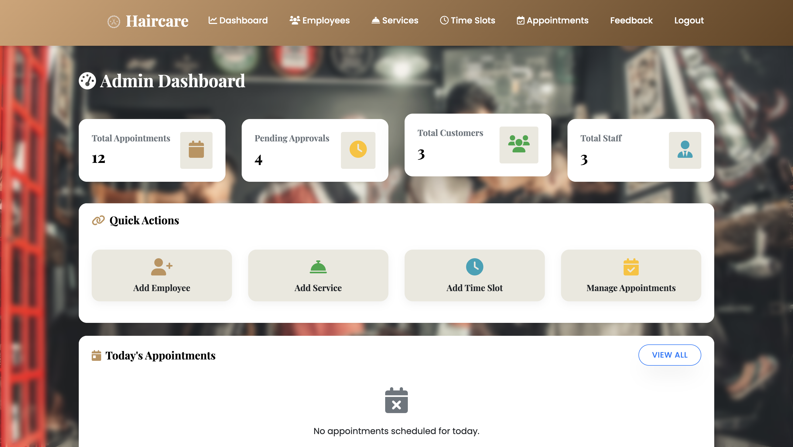
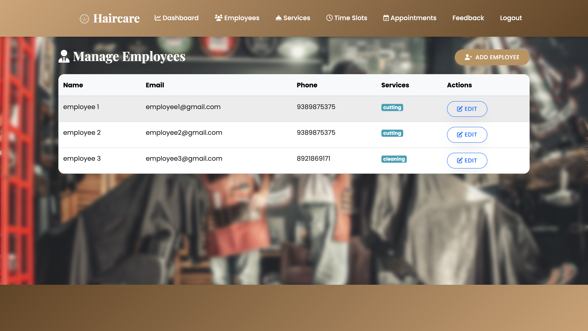
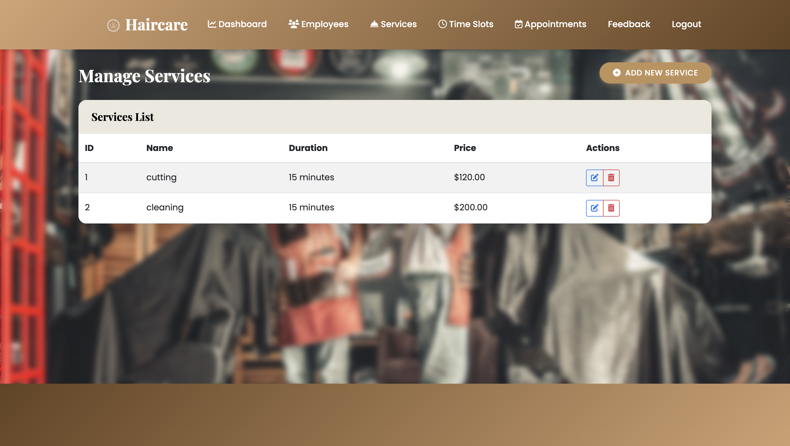
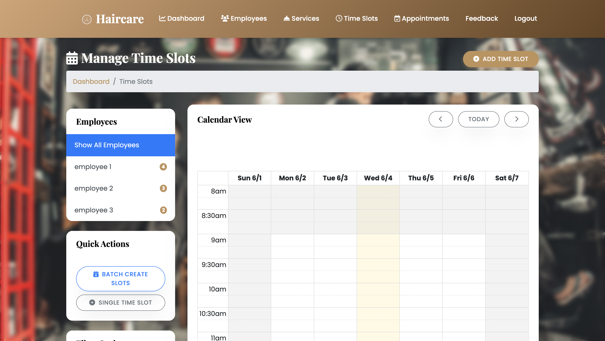
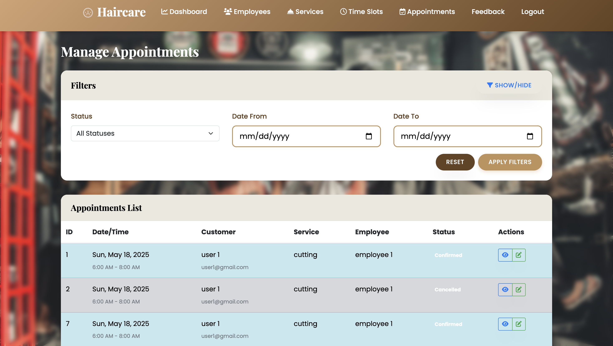
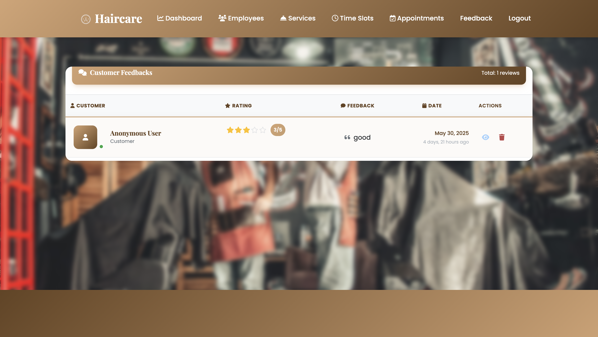

# 💈 Saloon Booking System

A web-based platform for managing salon bookings, services, staff, and customer interactions. The system supports two main roles: **Admin** and **Customer**, with distinct features for each.

---

## 🧩 Features

### 🔐 Admin Panel
- Login securely
- Manage Employees
- Manage Services offered
- Set and manage Time Slots
- View Feedbacks from customers
- Manage Appointments
- View Dashboard Analytics

### 👥 Customer Interface
- Registration and Login
- Browse Available Services
- Check Time Slot Availability
- Book Appointments
- View Booking History & Status
- Add Feedback

---

## 🛠️ Installation

1. Clone the repository:

```bash
git clone https://github.com/yourusername/saloon-booking-system.git
cd saloon-booking-system
```

2. Create a virtual environment and activate it:

```bash
python -m venv env
source env/bin/activate  # On Windows: env\Scripts\activate
```

3. Install dependencies:

```bash
pip install -r requirements.txt
```

4. Run database migrations:

```bash
python manage.py makemigrations
python manage.py migrate
```

5. Create a superuser (admin):

```bash
python manage.py createsuperuser
```

6. Start the development server:

```bash
python manage.py runserver
```

Visit: [http://127.0.0.1:8000](http://127.0.0.1:8000)

---

## 🗃️ Database Design

Includes models for:
- CustomUser (with role distinction)
- Employee
- Service
- Time Slot
- Appointment
- Feedback

---

## 🧑‍🎨 Data Flow Diagrams

This system is documented with DFDs for:
- Context Level
- Level 1 (Admin)
- Level 1 (Customer)

For more details, see the `SaloonDFD.pdf` file.

---

## 🧰 Tech Stack

- **Backend**: Python, Django
- **Frontend**: HTML, CSS, JavaScript
- **Database**: SQLite (default) / PostgreSQL (optional)
- **Others**: Bootstrap / Tailwind CSS

---

## 📬 Feedback

For suggestions or issues, please open an issue or contact the author.

---

## 🪪 License

This project is open-source and available under the [MIT License](LICENSE).

## 🖼️ Screenshots
### Register

### Login


### Dashboard


### Add Admin Dashboard


### Salon summary





